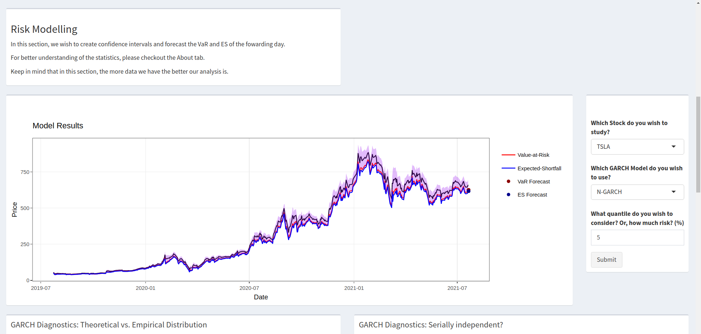

# Stock Portfolio Risk Manager

This is an Shiny app built with R to democratise the more in-depth risk-aware quantitative study of price stocks. The main goal is to build an open-source Shiny app for that study.

## Usage or installation

You can acess the app in the shinyapp.io platform with this [link](https://adriel-martins.shinyapps.io/Portfolio_Manager/?_ga=2.210384469.1377155949.1589635077-482263549.1556407394).

But, if you wish to run in your own computer, first clone this repository. Then, you must have R software installed and set the working directory as the folder that you downloaded. Finally, just run the file "app.R". It will automatically install the dependencies.

## In-App Flow and Input Details

The app follows the natural way of data exploration. First, descriptive, then modelling. There is also the About section in the app that explains all the statistics behind the app.

Please, notice that the stock inputs are following the symbols of the Yahoo Finance. You just have to enter on their site and check if the stock symbol is the one that you want. Normally, in the american stock market the ticket symbol is the same. However, for example, in the brazillian market it always differ. 

## Contributing and Future Improvements

Check the project area [here](https://github.com/Martins6/Stock_Portfolio_Manager/projects/1), in order to see the plans for the future. This app should focus on risk-related metrics or modelling for management of the portfolio. I would be glad to receive any suggestions.

Pull requests are specifically very much welcome! For major changes, please open an issue first to discuss what you would like to change. Otherwise, feel free to tweak and improve it however you want! Remember that the main goal is to build an open-source 'risk-centric' app for quantitative stock analysis.

## Acknowledgments

This app is from the R community to the R community (but not only). All the packages that made the app were free and open-source, that is amazing and I'm very thankful. Also, I would like to highlight the book "Reproducible Finance with R" made by Jonathan K. Regenstein. That book was the first inspiration to build this app.

## License
[GPL - 3.0](https://choosealicense.com/licenses/gpl-3.0/)
